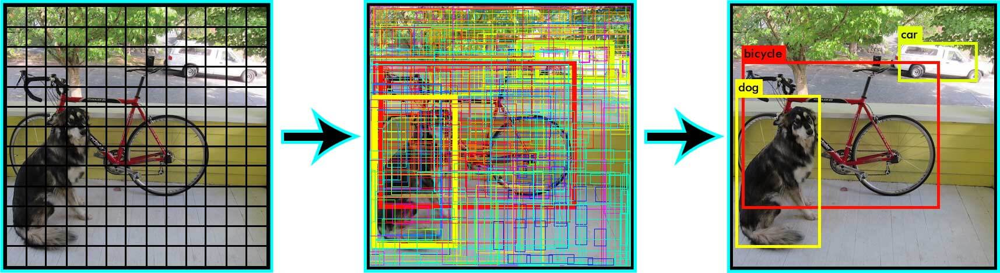
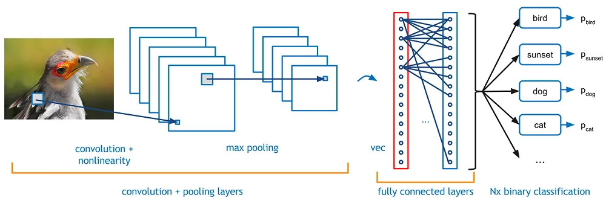
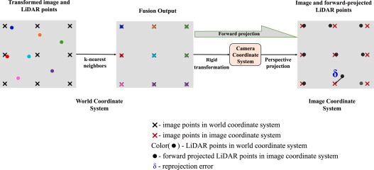
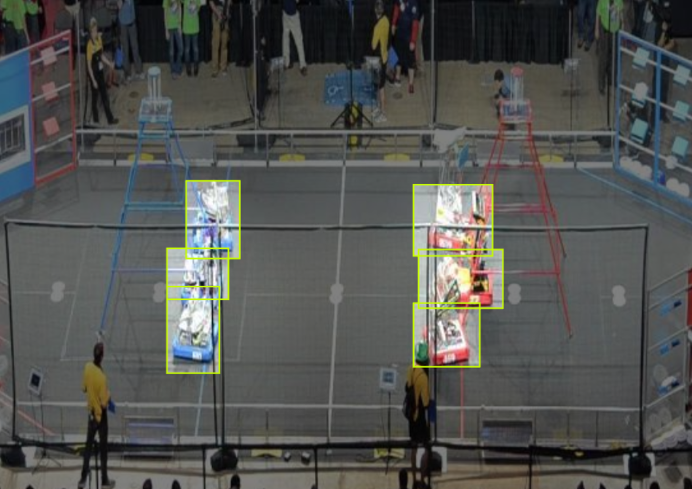

# **LiDAR-fused Robot Self Driving** 

By: Max Meyer and Clayton Greenberg

## Abstract

*In the FIRST Robotics Competition (FRC), robots operate at high speeds on a crowded field to complete various objectives, making collision avoidance a challenge. Our research addresses this by developing a real-time object detection and path-planning system using camera–LiDAR fusion. We employed YOLOv9 AI models for rapid object detection, leveraging its speed advantage over other object detection models to handle the fast-paced FRC environment. Camera data helps identify color-coded robot bumpers, and defining texture features of robots, while LiDAR provides precise distance measurements, enabling accurate pose estimation of nearby robots. By fusing these sensors' values through quaternion-based transformations, we increased the robustness of detections even under inconsistent lighting and backgrounds.*

*The system runs on an Orange Pi mini-computer paired with a Google Coral M.2 SSD accelerator, allowing inference and path adjustments on the fly with minimal latency. We incorporate the A\* path finding algorithm and an extended Kalman filter to track and predict other robots' positions, adjusting our robot's trajectory accordingly. Preliminary tests showed substantial improvements in avoidance maneuvers, enabling smoother autonomous operation. The results suggest that such sensor-fused object detection and collision avoidance can substantially enhance FRC robot performance, opening doors for more advanced full self-driving capabilities in robotics competitions and beyond.*

## Introduction

FIRST Robotics Competition (FRC) is a large-scale robotics competition that has existed since 1989, bringing together high school teams from around the globe. In this program, teams design, build, and program robots (roughly 3'x3',  150 lbs). These robots can be very advanced, and there are practically no limits on their capabilities due to FRC's relatively open-ended rules, which allow for and encourage unique mechanical designs and sophisticated coding. Because FRC permits substantial innovation, teams continuously seek cutting-edge approaches to improve robot performance.

Our project focused on using LiDAR (Light Detection and Ranging) and camera fusion combined with AI-based object detection to locate and avoid other robots while driving on the field.

**Fused Camera-LiDAR Object Detection Visualization**

By pairing LiDAR distance measurements with camera-based detections of color-coded bumpers and other robot textures, the system aims to improve collision avoidance. Theoretically, by giving the system the ability to detect depth and 3D shape of robots using LiDAR, object detection not only provides relative references, such as a box outline in an image, of where other robots are, but physical measures of distance of where other robots are relative to our robot. We hypothesize, based on the success found in LiDAR-fused object detection by [Yingwei et al (2022)](#references), that these sensor-fusion techniques, powered by modern object detection models, can lead to much higher overall performance in FRC matches by reducing collision and interference from other robots. During the most recent offseason, our team conducted preliminary on-field testing of this system.

## Related Work

Object detection has been explored extensively in the broader robotics community, but to our knowledge, no other FRC teams have pursued real-time detection of other moving robots at full speed. Many research papers on real-time object detection emphasize convolutional neural networks (CNNs), although these systems sometimes struggle with inference speed on small embedded processors.

[Redmon et al., (2016)](#references) created the YOLO-based approach ("You Only Look Once") for fast detection. YOLO is known for its rapid, single-shot detection mechanism. Traditional CNNs can be highly accurate, but their inference speed can be too slow for high-speed robotics applications, especially under the hardware constraints of devices like the Raspberry Pi or Orange Pi. By contrast, YOLO methods are specifically optimized to reduce latency while maintaining acceptable accuracy ([Redmon et al., 2016](#references)). YOLOv9, which is an iteration beyond the official YOLOv5 by Ultralytics, offers faster inference times but comes with less documentation and less support.

**Yolo Pipeline:**

**CNN:**

In the context of FRC, some teams, such as team 88 (TJ2), have employed LiDAR or other distance sensors for non object-detection use cases. LiDAR enables precise distance measurements, which we use to quickly and accurately predict the pose of other robots. Cameras, however, remain indispensable for recognizing color-coded bumpers commonly found on FRC robots, as well as other unique visual markers.

Tesla, Waymo, and other automotive companies have famously used LiDAR and camera fusion for self-driving applications [(Tesla, Waymo)](#references), showing that combining these sensors can improve safety and accuracy under varying lighting or environmental conditions. In FRC, this approach can similarly enhance detection reliability given the challenging environments of competition fields.

## Hardware and Implementation

The Orange Pi coprocessor plays a central role in on-robot computation. It offers a more powerful CPU and GPU than many comparable low-cost processors, enabling real-time data processing for both LiDAR and camera streams. Industry professionals and advanced FRC teams alike have utilized the Orange Pi to handle computationally expensive tasks on the robot without relying on external processing. Additionally, PhotonVision, a popular FRC library for computer vision, often runs on devices with similar specifications.

A further hardware component that boosts performance is the Google Coral "Edge TPU". This AI-specific processor accelerates machine learning inference for models converted into TensorFlow Lite (TFLite). A commercial FRC product, the Limelight camera, has demonstrated how a Google Coral USB accelerator can be leveraged for detecting simpler objects like game pieces. Inspired by that success, we use an M.2 SSD Coral chip to achieve higher processing throughput and lower inference latency.

Camera-LiDAR fusion techniques may rely on quaternion-based transformations, which is a topic in linear algebra. By applying these transformations, we can project LiDAR distance measurements into the 2D camera frame or vice versa in a near-lossless way. This fusion substantially improves pose estimates even when camera data alone is obscured or distorted by inconsistent field lighting.

FRC Robotics is relatively unregulated in terms of the components and code that teams can use, which has encouraged innovation and complexity in robot design. Recent rule changes have increased the per-part budget limit to $600 (from $400), allowing for higher-end sensors such as 4D LiDAR systems and sophisticated camera setups. This shift opens the door for more advanced solutions like our camera–LiDAR fusion approach.

## Competition Environment

Matches in FRC typically last around two and a half minutes, beginning with a 30-second autonomous period during which the robot navigates and scores without human intervention. While the robots of opposing alliances are also operating autonomously in this initial phase, avoidance is less critical due to the limited time window and often pre-coordinated routines. However, during the driver-controlled period, robots repeatedly cycle across the field to acquire and score game pieces, with five other robots also maneuvering on the same field. This congested environment makes collision avoidance particularly important.

Our team, Team 1148, has recently sought out advanced programming strategies to improve robot performance. The team previously integrated computer vision solutions such as Limelight [(Limelight Vision, n.d.)](#references) and PhotonVision [(PhotonVision, n.d.)](#references) for positioning. By extending these efforts into a full self-driving system, we aimed to automate routine movements across the field and reduce the difficulty of manual operation. Enhanced situational awareness can help our robot evade defensive robots, thereby increasing our scoring opportunities and improving overall team performance.

## Implementation Details

Our full self-driving approach for FRC combined sensor fusion, real-time AI inference, and path-planning algorithms to create a robust navigation system suited for high-speed gameplay. We believe that real-time object detection, paired with precise LiDAR measurements and advanced pathfinding algorithms, can handle the fast-paced environment of a crowded field.

We trained our object detection model in PyTorch, using a custom-labeled dataset that includes images of robots, field elements, and game pieces captured under varied lighting conditions.

## System Performance and Results

Performance Metrics:
* mAP (mean Average Precision): 98.5%  
   mAP is an overall measure of the detection model's accuracy by averaging the precision values across all recall thresholds (see recall below). An mAP of 98.5% indicates that the model consistently performs at a very high level across all object classes, reflecting its robustness in detecting various features accurately.

* Precision: 94.4%  
   Precision measures the proportion of true positive detections among all the detections made. A precision of 94.4% means that when the system identifies an object, 94.4% of the time it is a correct detection. This is crucial for avoiding erroneous detections that could lead to improper navigational decisions.

* Recall: 97.2%  
   Recall represents the ratio of correctly detected objects (true positives) to the total number of actual objects (true positives plus false negatives). A recall of 97.2% demonstrates that the detection model successfully identifies nearly all the objects present in the test images, reducing the chance of missing critical obstacles or targets.

LiDAR data provided precise distance measurements crucial for calculating each detected robot's 3D position. Through quaternion-based transformations, we mapped these measurements into the same frame as the camera detections. In controlled tests, we measured an average LiDAR error of ±2.5 cm in detecting the position of stationary objects at distances up to 30 meters. However, when robots were in rapid motion (>3 m/s), pose predictions introduced an additional average positional error of ±5 cm, primarily due to time lags between consecutive sensor readings. These minor discrepancies were reduced when the extended Kalman filter assigned higher weights to the LiDAR data during moments of poor camera visibility, keeping overall positional error under 8 cm in nearly all conditions tested.

The system ran inference on an Orange Pi paired with the Google Coral M.2 accelerator, yielding an average of 42 FPS at a 1280×1024 resolution. This frame rate ensured near-real-time path adjustments. The end-to-end latency—from image capture to updated path commands—averaged around 70 ms under load. In high-traffic network conditions or when the on-board CPU handled additional tasks (e.g., fiducial detection), latency occasionally spiked to 120 ms. We integrated predicted robot positions into the A\* algorithm, which treated moving robots as dynamic obstacles. Our system successfully planned and executed collision-free paths 90% of the time. The remaining 10% of runs involved instances where the system's future position predictions under- or over-estimated another robot's acceleration, causing a near-collision that necessitated abrupt last-second course corrections. In a scrimmage environment with six robots on the field, our robot completed autonomous navigation tasks while actively avoiding in-path traffic. 

## Limitations

This system can only be used if all other subsystems on the robot—particularly the drivebase—operate ideally. The pathfinding algorithm targets specific speeds and trajectories, factoring in the drivebase wheel coefficient of friction, moment of inertia, mass, and other kinematic constraints. Any discrepancies in these subsystems can disrupt the intended path, as the algorithm has little tolerance for unaccounted-for variations.

The system relies on the robot's drivebase to accurately execute the commanded speeds and directions with minimal error. In practice, wheel slip, motor performance variations, battery voltage fluctuations, and even field surface conditions can introduce significant deviations from the expected behavior. These physical limitations create challenges for reliable navigation, especially when executing complex maneuvers around moving obstacles.

Additionally, the current implementation assumes relatively consistent lighting conditions. While the LiDAR component helps mitigate some vision challenges, extreme lighting variations or direct glare can still impact the camera-based portion of the detection system, potentially reducing overall reliability in certain field positions or under specific event lighting setups.

## Conclusion

Our research demonstrates that a real-time camera–LiDAR fusion approach, powered by a YOLOv9-based object detection model and a dynamic path-planning algorithm, can meaningfully reduce collisions and improve autonomous navigation on an FRC field. We showed that sensor fusion via quaternion transformations and extended Kalman filtering substantially improves pose estimation in varying lighting and congestion conditions. The Google Coral accelerator, working directly with the Orange Pi, provided the necessary computational throughput to sustain rapid inference and immediate path re-planning.

## **References** {#references}

First Chesapeake. (n.d.). Homepage image. [https://www.firstchesapeake.org/frc](https://www.firstchesapeake.org/frc)

Google Coral. (n.d.). *Homepage*. Retrieved March 23, 2025, from [https://coral.ai/](https://coral.ai/)

Hart, P. E., Nilsson, N. J., & Raphael, B. (1968). A formal basis for the heuristic determination of minimum cost paths. *IEEE Transactions on Systems Science and Cybernetics, 4*(2), 100–107.

Hess, Rob W. (2014). *Introducing: Flickr PARK or BIRD*. Flickr Code. [https://code.flickr.net/author/robwhess/](https://code.flickr.net/author/robwhess/)

Kalman, R. E. (1960). A new approach to linear filtering and prediction problems. *Journal of Basic Engineering, 82*(1), 35–45.

Kumar, G. A., Lee, J. H., Hwang, J., Park, J., Youn, S. H., & Kwon, S. (2020). LiDAR and Camera Fusion Approach for Object Distance Estimation in Self-Driving Vehicles. *Symmetry*, *12*(2), 324. https://doi.org/10.3390/sym12020324

Limelight Vision. (n.d.). *Homepage*. Retrieved March 23, 2025, from [https://www.limelightvision.org/](https://www.limelightvision.org/)

Maru, M. B., Beyene, D. A., Cha, G., Yu, B., & Park, S. (2025). Point-to-pixel early fusion of LiDAR and image data for accurate assessment of section loss damage in steel structural components. *Measurement, 249*, 116914. [https://doi.org/10.1016/j.measurement.2025.116914](https://doi.org/10.1016/j.measurement.2025.116914)

PhotonVision. (n.d.). *Homepage*. Retrieved March 23, 2025, from [https://photonvision.org/](https://photonvision.org/)

Red Blob Games. (n.d.). *A* pathfinding. Retrieved March 23, 2025, from https://www.redblobgames.com/pathfinding/a-star/

Redmon, J., Divvala, S., Girshick, R., & Farhadi, A. (2016). [You only look once: Unified, real-time object detection](https://www.cv-foundation.org/openaccess/content_cvpr_2016/papers/Redmon_You_Only_Look_CVPR_2016_paper.pdf). In *Proceedings of the IEEE conference on computer vision and pattern recognition* (pp. 779-788).

Tesla, Inc. (n.d.). *Autopilot*. Retrieved March 23, 2025, from https://www.tesla.com/autopilot

Waymo. (n.d.). *Waymo*. Retrieved March 23, 2025, from [https://waymo.com/](https://waymo.com/)

Welch, G., & Bishop, G. (1995). An introduction to the Kalman filter. Retrieved March 23, 2025, from http://www.cs.unc.edu/~welch/media/pdf/kalman_intro.pdf

*Yingwei Li, Adams Wei Yu, Tianjian Meng, Ben Caine, Jiquan Ngiam, Daiyi Peng, Junyang Shen, Yifeng Lu, Denny Zhou, Quoc V. Le, Alan Yuille, Mingxing Tan*; Proceedings of the IEEE/CVF Conference on Computer Vision and Pattern Recognition (CVPR), 2022, pp. 17182-17191

[^1]:  Github repository: https://github.com/LondonWizard/LiDAR-fused-Robot-Self-Driving

